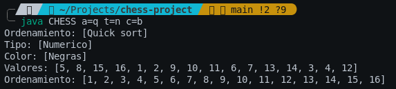
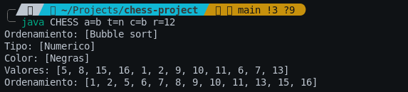

# Project Capstopne - Chess

**Descripcion:**
Desarrollo de un simulador de Ajedrez en Java que aplique los principios
de la Programación Orientada a Objetos (POO) para la creación de las
piezas y utilice algoritmos de ordenamiento para organizarlas en un
tablero de ajedrez de 8x8.

**Importante:**
Todo el codigo del proyecto, es solo una maqueta para esta entrega parcial, tiene mucho que mejorar y ademas de mejores practicas.

**Detalles:**
Este proyecto hace uso de tres algoritmos de ordenamiento Insertion Sort, Quick Sort, Bubble Sort. Estos algoritmos se puede escoger mediante el la entrada por CLI, en el caso de no escoger ningún algoritmo se asignará alguno aleatoriamente.

## Evidencia de ejecucion

- Santiago Zambon