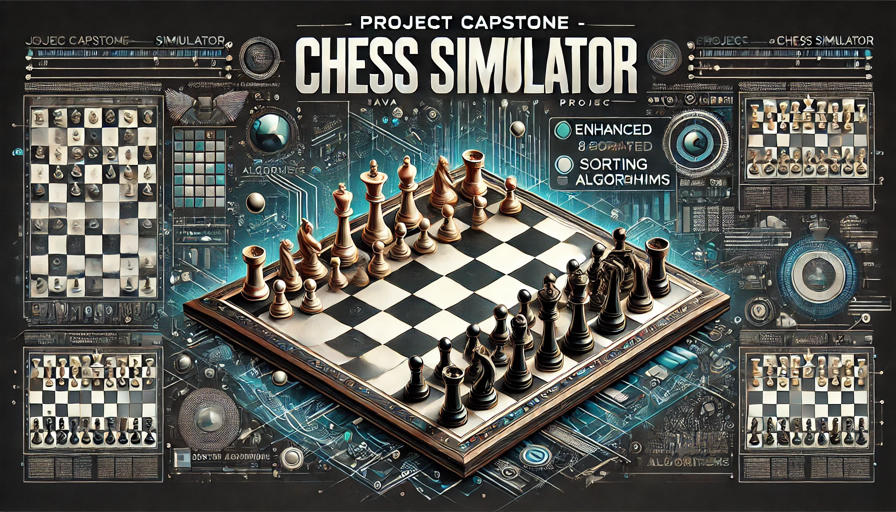

# Project Capstone - Chess

**Descripción:**
Este proyecto consiste en el desarrollo de un simulador de ajedrez en Java, diseñado para aplicar los principios de la Programación Orientada a Objetos (POO) en la creación de las piezas de ajedrez. Además, se incorporan algoritmos de ordenamiento para organizar estas piezas en un tablero de ajedrez de 8x8.

**Detalles:**
El proyecto implementa tres algoritmos de ordenamiento: **Insertion Sort**, **Quick Sort**, y **Bubble Sort**. Estos algoritmos pueden ser seleccionados a través de la línea de comandos (CLI). En caso de no especificar un algoritmo, se asignará uno aleatoriamente.

---

**Autor:**
Santiago Zambon
